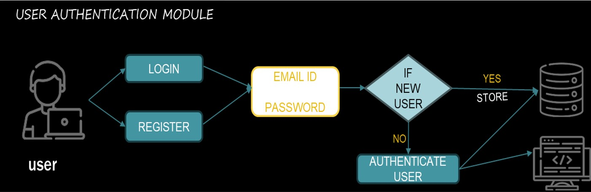
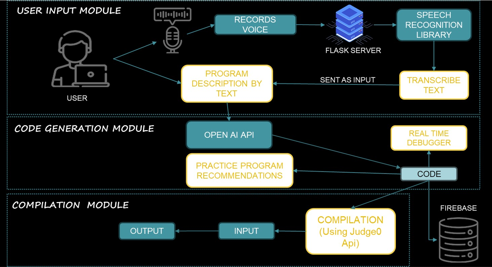

# VoizzedX- Speak to Code
VoizzedX : A voice-driven code generation  for real-time coding  Empowering developers and learners with speech recognition, multi-language support, and cloud integration for efficient coding.

## Technology Stack
- **Flask Server**
- **React JS**
- **Python**
- **OpenAI API**
- **Firebase**
- **Judge0 API**

## Key Features
1. **Voice Based Coding**: Utilizes Automatic Speech Recognition (ASR) technology to enable developers to write code by voicing their ideas and instructions.
2. **Multi Language Support**: Supports multiple programming languages, including C, C++, Java, JavaScript, and Python.
3. **Cloud Support**: Utilizes cloud storage APIs such as Google Firebase and authentication mechanisms to enable developers to generate code.
4. **Program Recommendation**: Recommends related or relevant code snippets, libraries, or resources after a user chooses to execute a program, assisting the user in achieving their coding goal.

## Architecture:

## Applications
1. Educational Institutions
2. Self Paced Learning
3. Code Review and Debugging
4. Online Coding Community
   

## Conclusion
"VoizzedX" is a powerful tool that automates the conversion of scripts into executable code. It streamlines the development process, saving time and reducing human error. Its ability to transform complex scripting languages into functional code enhances productivity and simplifies software development. In summary, VoizzedX is a valuable asset for developers seeking efficient code generation from scripts.

## Video Demonstration
Check out our video demonstration to see VoizzedX in action:

